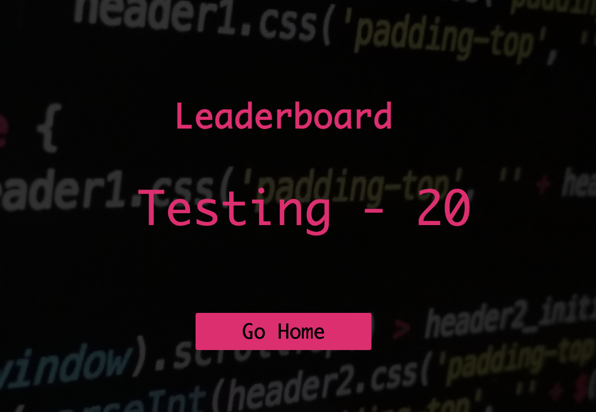

# Milestone Project Two | Are you ready to test your computing knowledge?
 

 
[View the live project here](https://aoibhinn.github.io/portfolio_2/)  
 
## About
 
This website has been created for my Milestone 2 Interactive Frontend Development project.
 
I want to create a music quiz game to test the players computing knowledge. The user will be given 5 random questions, worth 10 points a question, with 30 seconds to answer each. With a maximum of 50 points, the user will be able to save their high score and try to get on the top 5 leaderboard.

## User Experience-(UX)
 
### Site Goals
 
 1. I want the site to be attractive, responsive and easy to use for the user.
 2. I want the site to work as intended incrementing the questions and score as the user progresses, with the timer going down for each question.
 3. I want the user to have a varied choice of questions.
 4. I want the user to be able to save their score.
 5. I want the user to be able to navigate easily through the different pages of the site.

 ### User Stories
 
 * #### First Time Visitor Goals
  1. I want the game to be attractive and and easy to read all text.
  2. I want the game to be responsive to whichever device I am playing it on.
  3. I want to be able to navigate around the different pages of the site.
  4. I want to be given a choice of varied questions.

  * #### Returning/ Frequent Visitor Goals
  1. I want to be given varied questions each time I play.
  2. I want to be able to record my score and try to get on a leaderboard.
  3. I want to see other users previous scores so I can try to beat them.

    
### Design
 
Because of the topic of the quiz, I want the design of the website to have a digital/coding themed background. It needs to be pleasing for the user to look at with the game elements easily distinguishable from the background so that everything is clear and easy to use. To do this I will have a fairly dark background with bright neon colors being used for the game so they will contrast nicely together.
I want to keep a consistent theme throughout the site by using the same colour combinations on each page. With the site being attractive for the user and easy to use I am hoping the user will want to keep returning to play the game.

 * #### Wireframes
 
To make my wireframes I have used balsamiq. I have done one for each page and did a design for larger screens and smaller screens to show how the site will be responsive to screen size and change accordingly. The links to each one are below. 

 * #### Imagery
 
For this project I have used one image to be the main background across all the different pages of the site. It is an image with some code written as I felt it suited the theme of the quiz. I also placed a transparent overlay on top of the image to soften the brightness of it, and help enhance the interactive parts of the site for the user making it all stand out clearly and be visually appealing as well as usable and easy to see.

 * #### Color Scheme
 
For this project I wanted the colour to be vibrant and really pop out against the darker background that I chose. The main colour used is a neon pink that is also included in the background image. I have used this colour throughout all the differnt elements of the game including text colour and buttons. 
 
* #### Typography

  The font I have used in this project is **Raleway** which was imported from **Google Fonts**. I chose to just use one font for all text throughout the quiz as I feel it's easy to read and works well with the background image.
 
## Features
 
The design and layout of the game is responsvie to all different screen sizes and remains attractive and easy to use no matter what device it is being played on.
 
  * ### Home Page
    * **High Scores** button that when clicked will link the user to the top 5 highscores. These scores are stored and pulled from local storage.
    * **Play** button that links the user to the main game page.
 
 * ### Game Page
   * A question counter that shows the user which question number they are on out of 5.
   * A score counter that shows the user what they're current score is and that increments by 10 for every correct answer.
   * A question and 5 possible answers to choose from. The selected answer will turn red if it is wrong with an alert pop up displaying the correct answer. If the answer is correct the answer will turn green.
   * A 30 second timer that counts down on screen and resets for each new question.
   * A home button that will take the user back to the main page.
   * 
 * ### End Page
   * A display of the users end score.
   * The option for the user to enter their name and save their score which will be added to the highscore page if the score is high enough.
   * A button to let the user play again.
   * A button to take the user back to the home page.

## Technologies used
 ### Languages used
 
  * [HTML5](https://developer.mozilla.org/en-US/docs/Web/Guide/HTML/HTML5)  
    The project uses HTML5 to make up the basic elements and structure of the website.
  * [CSS3](https://developer.mozilla.org/en-US/docs/Web/CSS)  
    I have used CSS3 to add my own styling to the project including layout, fonts and colours.
  * [JavaScript](https://developer.mozilla.org/en-US/docs/Web/JavaScript)  
    JavaScript has been used to implement the site's interactive features, Allowing the user to be interactive with the game.

 ### Frameworks, Libraries and Programs Used
 
  * [Balsamiq](https://balsamiq.com/)  
    I used balsamiq to design and draw up my wireframes before starting the project.
  * [Font Awesome](https://fontawesome.com/)  
    This was used for the logos of the social media links on my home page and also the clock symbol and home button on the game page. 
  * [Google Fonts](https://fonts.google.com/)  
    Google fonts was used throughout the project to import my selected font **Raleway**.
  * [Gitpod](https://www.gitpod.io/)  
    Gitpod was the text editor I used to write all of my HTML, CSS and JavaScript code to style, structure and make the game interactive.
  * [Git](https://git-scm.com/)  
    Git is used as version control software to add, commit and push code to my GitHub repository where the code is then stored.
  * [GitHub](https://github.com/)  
    I have used GitHub as a remote repository to push and store the committed changes to my project from Git. GitHub pages has also been used to deploy my live site.
  * [Google Chrome Developer Tools](https://developer.chrome.com/docs/devtools/)  
    I have used Google chromes built in developer tools to help with the styling of the site, selecting colors and to help fix any bugs I found.
  * [Open Triva DB api](https://opentdb.com/api_config.php)  
    I have Open Trivia DB API key to fetch questions and answers for the quiz.

## Testing
 
### Testing User Stories and Site Goals
 
### Site Goals
 
 **1. I want the site to be attractive, responsive and easy to use for the user.**
 
 - To get feedback on the visual aspect of the project it has been shared with many friends and family and also other students of code institute via the slack portal. The feedback on the visual aspect has been really good, with the choice of colors and fonts receiving very positive reviews.
 - I have tested the site on different screen sizes such as Iphone 11, Macbook air.
 The site responds well to the different screen sizes and the layout adapts as intended. 
 - The game has a clear and simple layout making it easy for the user to navigate through and play. With contrasting colours making all the different features clear and visible for the user to see.

  **2. I want the site to work as intended incrementing the quesitons and score as the user progresses, with the timer going down for each question.**
 
 - After testing the game many times across multiple devices I am confident that the features are working as intended. The question counter runs from 1 to 5 and ends the game after the 4th question taking the user to the end game page and displaying their score. The score increments as expected, awarding 10 points for each correct answer and the time decreases from 30 seconds for each question. If the time runs out on a question it automatically ends the game and redirects user to save score page.

  * Question counter  
 
 * Score counter  
 
 * Question timer  
 

### Returning/ Frequent Visitor Goals

**1. I want to be able to record my score and try to get on a leaderboard.**
 
 - When finishing the game the user will have their score displayed on the screen. Depending on the score they achieve will bring up a different message. From here they will have the choice to enter their name and save their score. The top 5 scores will be saved to a leaderboard that can be viewed from the homepage. The user will be able to see if their name is on it from here.
 - The users scores are saved to local storage.

  
  

### Features Testing

* ### Home Page
   **1.** **High Scoresbutton that when clicked will link the user to the top 5 highscores. These scores are stored and pulled from local storage.**
 
   - This function is working as intended, it has been tested on different devices with different scores being saved to the local storage. Then displaying the top 5 highest scores in the correct order.
 
   **2.** **Play button that links the user to the main game page.**
 
   - This button has been tested many times across various devices and works as intended.

 * ### Game Page
    **1.A question counter that shows the user which question number they are on out of 4.**
    **2.A score counter that shows the user what they're current score is and that increments by 10 for every correct answer.**
 
    - Both of the above have been tested many times on differnet devices and increment the question number and score as expected everytime.

    **3.A question and 4 possible answers to choose from. The selected answer will turn red if it is wrong and green if it is correct.**
 
    - The answers are displayed in different orders each time. When the correct answer is clicked it turns green. When it's wrong it will display red and the correct answer is displayed as an alert. 

    **4.A 30 second timer that counts down on screen and resets for each new question.**
 
    - The timer for each question displays and works as intended with the time restarting for each new question and counting down from 30 at the correct speed.

    **5.A home button that will take the user back to the main page.**
 
    - A simple home logo button will take the user back to the main menu on the home page. This link has been checked many times and works as expected.

   * ### End Page
   
   **1.A display of the users end score.**
 
    - This has been checked and displays the correct score after the 10th question is answered.

    **3.The option for the user to enter their name and save their score which will be added to the high score page if the score is high enough.**
 
    - I have checked this using different devices and also asked friends and family to play the game and save their score to see if they appear on the leaderboard. Each time it has worked as intended.

    **4.A button to let the user play again.**
 
    - At the end of the game the user has the option to play again. By clicking the *Play Again* button the user is automatically taken back to the start of the game. This works as expected.
 
    **5.A button to take the user back to the home page.**
 
    - At the end of the game the user has the option to return to the home page. By clicking the *Home* button the user is automatically taken back to the main menu This works as expected.

  ### Validator Testing
 
  - HTML
  - One error was returned when passing through the official W3C validator. There was a stray end tag on the index.html file. This has since been removed. 
  - No errors were returned for the highscores.html file when passing through the official 
   - No errors were returned for the game.html file when passing through the official 
  - No errors were returned for the end.html file when passing through the official 
 
 
  - CSS
  - Two errors found when passing through the official [Two errors found on (Jigsaw) validator](assets/images/two_errors_W3C.png). These were resolved [(Jigsaw) validator](/workspace/portfolio_2/assets/images/CSS_Validated.png

## Deployment

### Initial creation
 
I created the repository using the following steps:
  1. Logging into my [GitHub](https://github.com/Aoibhinn/portfolio_2) account and clickng the green button near the top left of the page displaying the text **NEW.**
  2. This took me to a page with the option to create a new repository. Under *repository template* I clicked on the *code institute* template. I chose a name for the repository suitable for the project and then clicked the *create repository* button.
  3. I opened the new repository and clicked the green *gitpod* button to create a new workplace in Gitpod for writing and editing my code to develop the site.

 ### Github Pages
 
  My project was deployed to GitHub pages using the following steps:
  1. Logging in to my [GitHub](https://github.com/Aoibhinn/portfolio_2) account and opening the relevant repository.
  2. Click on the settings button, located just above the green **GITPOD** button.
  3. In settings scroll down to the **GitHub Pages** section.
  4. Under **source** click the dropdown button labelled **None** and select **Master Branch.**
  5. The page will automatically refresh itself and after a few moments the published site link will be availible to click on the **GitHub Page** section.

  The live link can be found here - https://aoibhinn.github.io/portfolio_2/

### Forking the GitHub Repository
 
  Forking a repository enables us to make a copy of the original repository on our GitHub account so we can view it and make changes with out affecting the original work.
  This is done using the following steps:
  1. Log in to [GitHub](https://github.com/Aoibhinn/portfolio_2) account and select the relevant repository.
  2. To the top right of the page there are three the buttons, the furthest right says **Fork.** Click on this button.
  3. A copy of the original repository will now be in your account.

### Making a Clone
 
  To make a clone of my project use the following steps:
  1. Go to my [account](https://github.com/Aoibhinn/portfolio_2) and locate relevant repository.
  2. Next to the green **Gitpod** button, click on **CODE.**
  3. Click on **Download Zip.**
  4. Once dowloaded, you can extract the zip file's contents and save to a desktop and run the website locally.

### Code, Content & credits
 
* [Google](https://www.google.com/) was used to find the background image used on each page of the project. It was also used extensively to help research the project, find solutions to any quries or issues I had and help find example codes to use in my own project.
* [W3schools](https://www.w3schools.com/) was used to help build the spinning loader displayed before the questions are loaded.
* [Muhanad Hasan](https://www.youtube.com/watch?v=9-5URe9CykA&t=113s) This video helped me to make my own countdown timer for each question.
* [Stackoverflow](https://stackoverflow.com/) was used to help find solutions to the issues I had whilst building my project.
* [BrianDesigns] The funcationlaity for the game was inspired by Brian Designs video on creating a short quiz https://www.youtube.com/watch?v=f4fB9Xg2JEY&t=2749s
* [FontAwesome] The icon on the home page were taken from font awesome (https://fontawesome.com/)